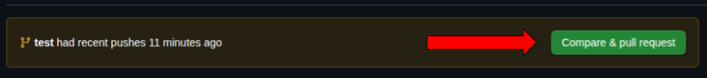
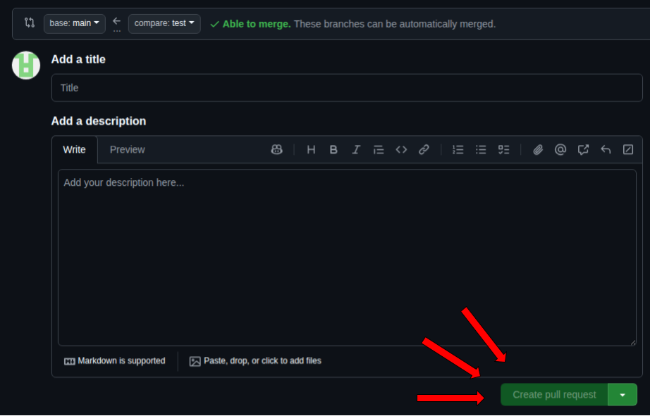

# *Flujo de trabajo*
Estimados, con el proposito de ayudarnos mutuamente queriamos documentar como principalmente se debería trabajar de acuerdo a lo solicitado por la profesora Elizabeth, como tal los repositorios fueron separados para que cada uno tuviera sus propios testeos y correciones correspondientes.

Entonces como nocion, principalmente se dará permiso a un solo miembro colaborador para que pueda realizar las pull request, que se hacen realizando una nueva rama, dado que la rama main cuenta con proteccion y reglas para que trate de ser
lo más sincrona posible.

Una vez creada la nueva rama, usted debería realizar los PR para que alguno de los miembros de DevOps se encargue de aceptar o rechazar los PR una vez pase por los checkeos.

La continua integracion se realizará atraves de GitHub Actions con el fin de automatizar verificaciones y entregar retroalimentaciones correspondientes.

Por favor tratar de por cada commit una funcionalidad o minimizar lo minimo posible para indicar apropiadamente donde deberían hacerse las correcciones si es necesario

# TUTORIAL:

## Como clonar el repositorio
```sh
git clone https://github.com/JuanjoLT/hospital-backend.git
```

## Crear nueva rama
```sh
git checkout -b <nombre_rama>
```

## Agregar archivo de cambio
```sh
git add <nombre_archivo> <nombre_archivo>
git commit -m "Descripcion de los cambios"
git push -u origin <nombre_rama>
```

## Crear Pull Request
### Vamos a la pagina web del repositorio en GitHub:
```
https://github.com/JuanjoLT/hospital-backend.git/tree/<nombre_rama>
```
### Presionamos el siguiente boton:



### Luego Proporcionamos un titulo del cambio y una descripcion de este:


